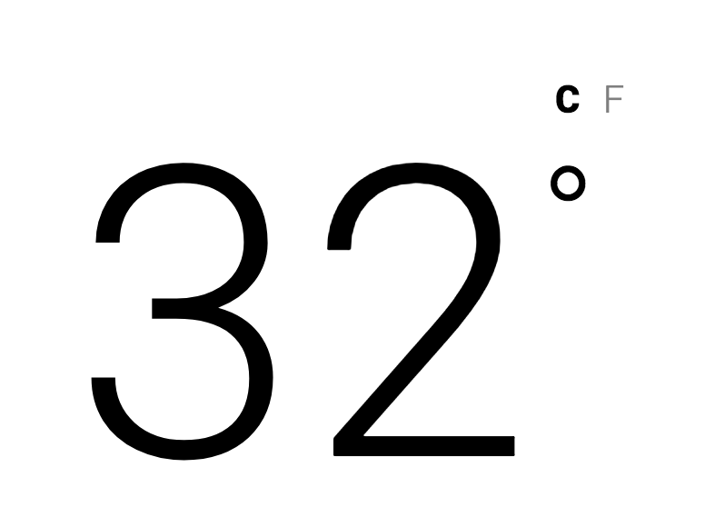

# PROVA ECMA

## OBSERVAÇÕES

* * *

Leia atentamente as observações a seguir:

* A avaliação será realizada no computador, porém individualmente e em silêncio. Não deve haver nenhum tipo de comunicação entre os alunos;
* Cada questão é expressa através dessa indicação **(DD%)** que significa o critério de pontuação, contudo, a desorganização pode penalizar a pontuação final;
* No arquivo de resposta inclua um bloco de comentário no início de seu conteúdo com o nome e a matrícula do aluno;
* Ao concluir as questões chame o professor para avaliar a sua prova;
* Depois da avaliação envie os arquivos num diretório compactado, seguindo o formato de nome **ALUNO-MATRICULA** para o email **luiz.chaves.ifpb+avaliacoesls20172@gmail.com** com:

> **Assunto:** [IFPB] Prova II LS
>
> **Conteúdo:** Os arquivos da prova do aluno < nome do aluno > (< matrícula >) estão em anexo.

## DESCRIÇÃO DA PROVA

* * *

[diretório compactado](code.zip).

*Figura 1 - Site da previsão do tempo (Versão Mobile)*<br>


## QUESTÕES

* * *

**QUESTÃO 1 (50%)** - Use o arquivo `` para gerar dinâmicamente os elementos da *Figura 1*:

**a)** *Figura 2*

*Figura 2 - Cabeçalho do site da previsão do tempo.*<br>


**b)** *Figura 3*

*Figura 3 - Informação extra do site da previsão do tempo.*<br>


**c)** *Figura 4*

*Figura 4 - Previsão semanal.*<br>


**QUESTÃO 2 (50%)** - Criar a converção de temperatura (*Figura 5*) entre `Celsius` e `Fahrenheit`, lembrando que:

```
C = (F - 32) / 1.8
F = C * 1.8 + 32
```

*Figura 5 - Conversor.*<br>


<!-- > [Alternativa de resposta](code-response/). -->
