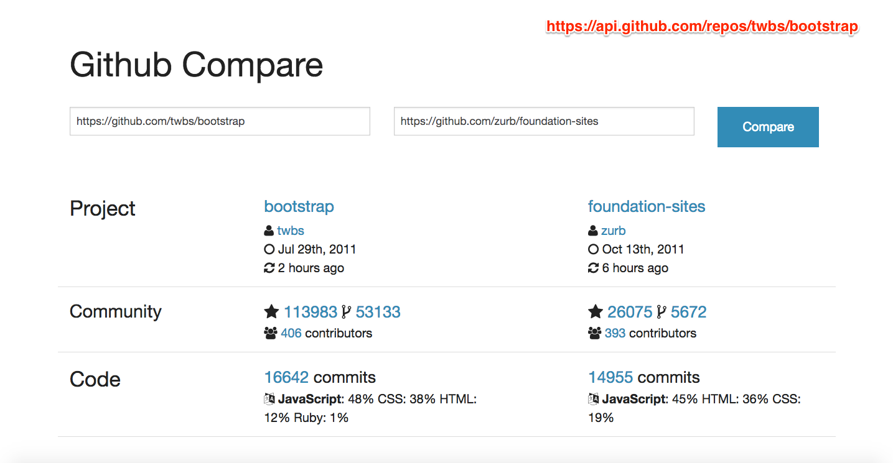

# PROVA ECMA

### OBSERVAÇÕES

Leia as observações a seguir:

* A avaliação será realizada no computador, porém individualmente e em silêncio. Não deve haver nenhum tipo de comunicação entre os alunos;
* No arquivo de resposta inclua um bloco de comentário no início de seu conteúdo com o nome e a matrícula do aluno;
* Ao concluir as questões chame o professor para avaliar a sua prova;
* Depois da avaliação envie os arquivos num diretório compactado, seguindo o formato de nome **ALUNO-MATRICULA** para o email **luiz.chaves.ifpb+avaliacoesls20171@gmail.com** com:

> **Assunto:** [IFPB] Prova II LS
>
> **Conteúdo:** Os arquivos da prova do aluno < nome do aluno > (< matrícula >) estão em anexo.

### DESCRIÇÃO DA PROVA

A prova será baseada na figura a seguir para propor uma comparação de repositórios do github:

